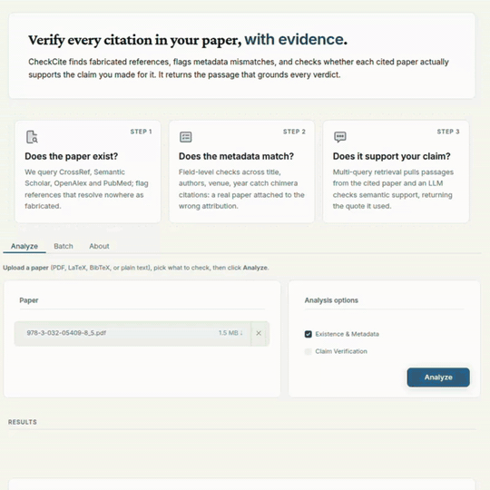

# CiteExtract

**Citation verification for scientific papers.** Given a paper (PDF, LaTeX, BibTeX, or plain text), CiteExtract returns two independent verdicts per reference: whether the cited paper *exists* with the stated metadata, and whether it actually *supports* the claim made for it. Each verdict also provide the passage from cited paper that grounds it.

**Live demo:** https://checkcitation-i7es4lszrq-uc.a.run.app/?token=PpDzIPg9V9Q2bFuiy0M0-w



This repository contains:

- **[`citeextract/`](citeextract/)** — the system (pipeline, web UI, HTTP API, tests, Dockerfile). See [`citeextract/README.md`](citeextract/README.md) to install and run.
- **[`experiment/paper/`](experiment/paper/)** — Experiments conducted for benchmarking. 

## To run  locally - Quick start

```bash
cd checkcitation/citeextract
python -m venv .venv && source .venv/bin/activate
pip install -e .
python -m spacy download en_core_web_sm
python -m citeextract_ui                 # web UI on http://localhost:7860
```

For PDF input, also run GROBID once: `docker run -d --name grobid -p 8070:8070 grobid/grobid:0.8.2-crf`.


